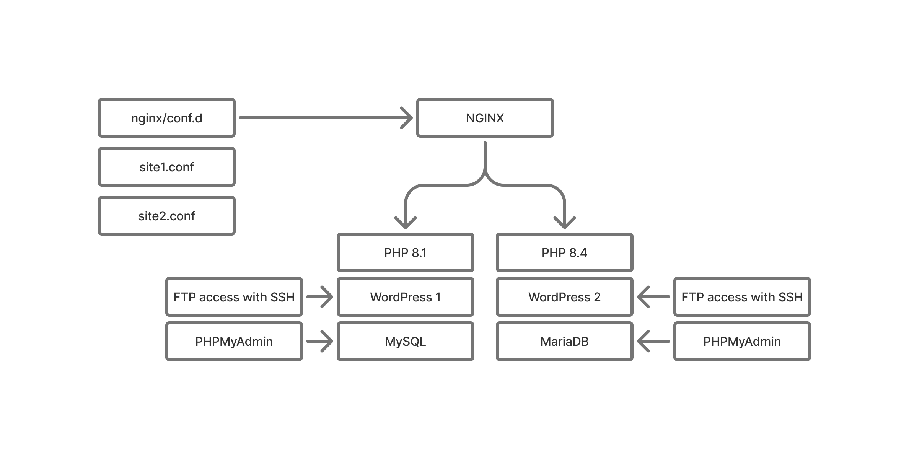

# WordPress Multi-Site Docker Deployment

This repository contains all necessary files to deploy a multi-site WordPress setup using Docker with the following architecture:

## Architecture



- **NGINX**: Reverse proxy and web server
- **Site 1**: WordPress with PHP 8.1 + MySQL
- **Site 2**: WordPress with PHP 8.4 + MariaDB
- **PHPMyAdmin**: Database management interface (2 instances)
- **SFTP**: Secure file transfer access for both sites

## Files Included
- `docker-compose.yml` - Main Docker Compose configuration
- `nginx/docker-nginx.conf` - Main NGINX configuration
- `nginx/docker-site1.conf` - Site 1 NGINX configuration (PHP 8.1)
- `nginx/docker-site2.conf` - Site 2 NGINX configuration (PHP 8.4)
- `.env.example` - Environment variables template
- `DOCKER-SETUP.md` - Detailed setup guide

## Quick Start
```bash
# Clone repository
git clone <your-repo>
cd <your-repo>

# Copy environment file and configure
cp .env.example .env
nano .env

# Start all services
docker-compose up -d

# Check status
docker-compose ps
```

## Access Points
- **Site 1**: http://localhost (or your domain)
- **Site 2**: http://site2.example.com
- **PHPMyAdmin (MySQL)**: http://localhost:8080
- **PHPMyAdmin (MariaDB)**: http://localhost:8081
- **SFTP Site 1**: Port 2221
- **SFTP Site 2**: Port 2222

## Requirements
- Docker Engine 20.10+
- Docker Compose 2.0+
- At least 4GB RAM
- 20GB+ storage

See DOCKER-SETUP.md for complete setup instructions.
